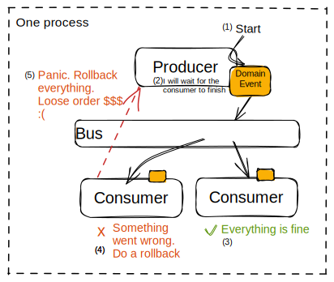
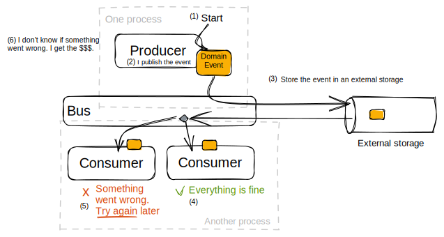

I recently saw the helpful video ["You DON'T want an In-Memory Event Bus like MediatR"](https://www.youtube.com/watch?v=KCvsk5tTP3w) of [CodeOpinion](https://codeopinion.com/). By watching the video I remembered another video of [Milan Jovanović](https://www.youtube.com/@MilanJovanovicTech) about the [transaction outbox pattern](https://www.youtube.com/watch?v=XALvnX7MPeo&t=404s). It's both about producing domain events and consume them safely without affecting the producer of the event.

I don't describe the topic in depth. Further more I want a little sketch / note to summarize the topic which will serve as guidance for my future architectural decissions.

# Scenario: Domain event is produced and consumed in one process

The producer is dependent on the consumer. But the producer should not be affected by the result of a consumer.

#  Producer is independent of the consumer

