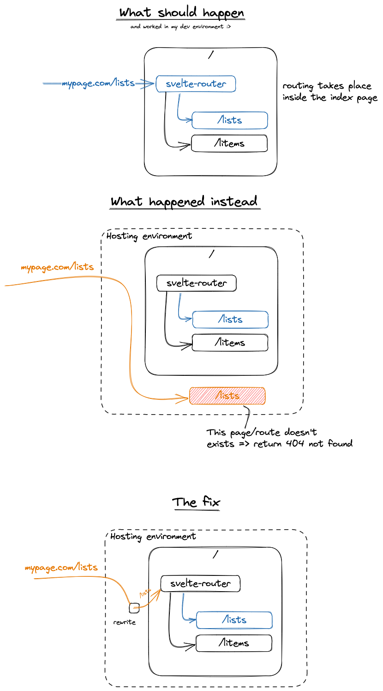

I have an app that uses Svelte as SPA frontend framework and svelte-router to differentiate the routes.

During development on my local machine everything works fine. But as soon as I deployed my app via vercel I got problems accessing different routes. 

A call to `mypage.com/lists` resulted in a 404.

The problem was that the server serving the frontend tried to find a route or file with `/lists` that didn't exist. But the route argument has to be served to the index file containing the routing logic. 

Adding a rewrite route in a vercel deployment is fairly easy. You just have to add/modify the `vercel.json` to your folder containing the project (e.g. the folder with the `package.json`).

```
{
    "rewrites": [{ "source": "/(.*)", "destination": "/" }]
}
```

After that I could access the desired routes.

In the following picture I illustrate the scenario and my journey :)


