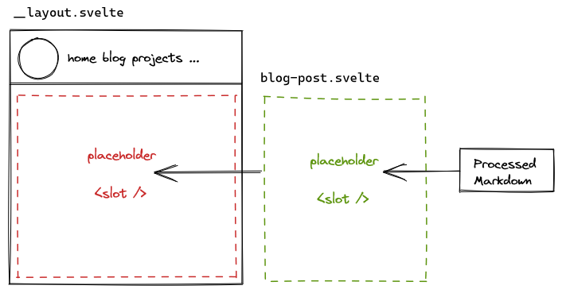

The layout of my website is defined in __layout.svelte file. The placeholder for the concrete content (slot) is missing a special styling. Therefore every page is able to define a placeholder styling that meets their needs. 

As described in my post ["Use markdown files as routes in SvelteKit"](/blog/use-markdown-files-as-sveltekit-routes) my markdown files are transformed to routes. So they needed a styling definition too. 

I just needed to create a layout svelte component and add the layout parameter to the mdsvex preprocessor in the svelte.config.js

```html
// src/layout/blog-post.svelte
// The blog post layout definition
<div class="container mx-auto md:w-4/5">
	<slot />
</div>
```

```javascript
// svelte.config.js
const config = {
    ...
	preprocess: [
		preprocess(),
		mdsvex( ... , layout: './src/layout/blog-post.svelte' })
	],
```

In the figure you can see the usage of the different layouts.

